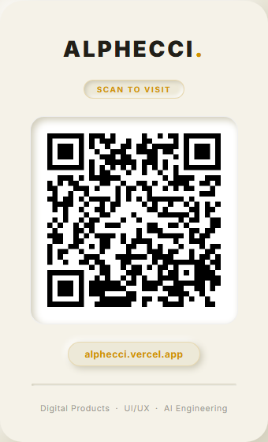
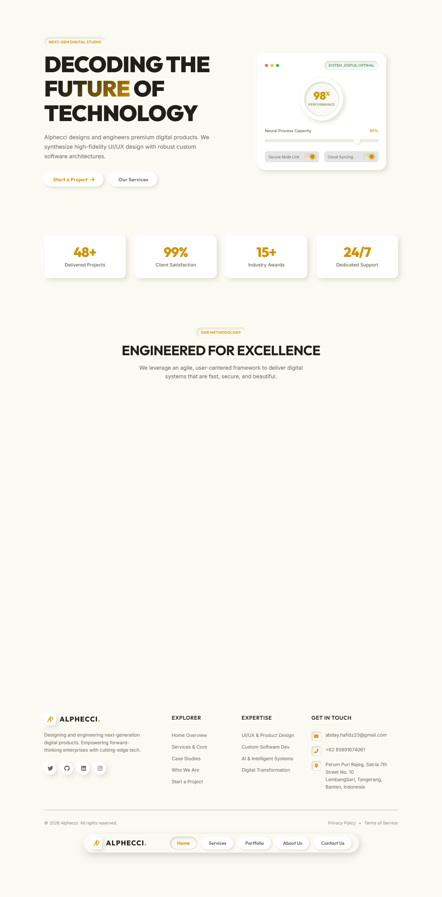
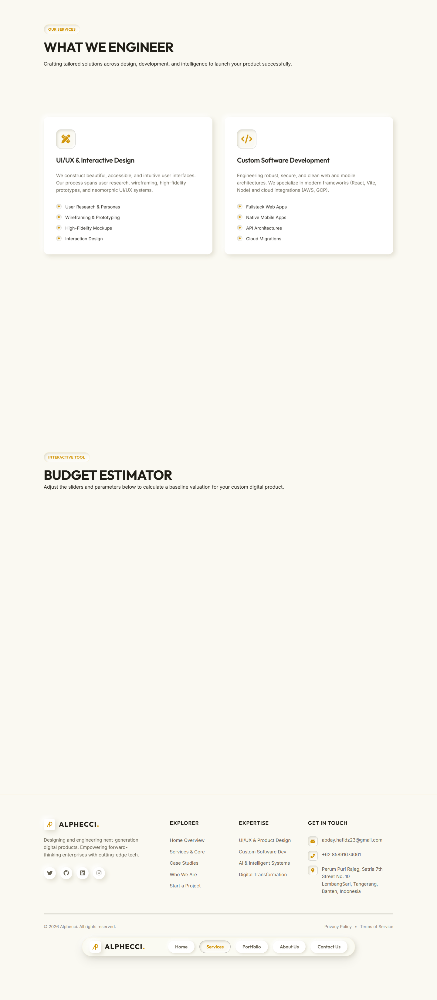
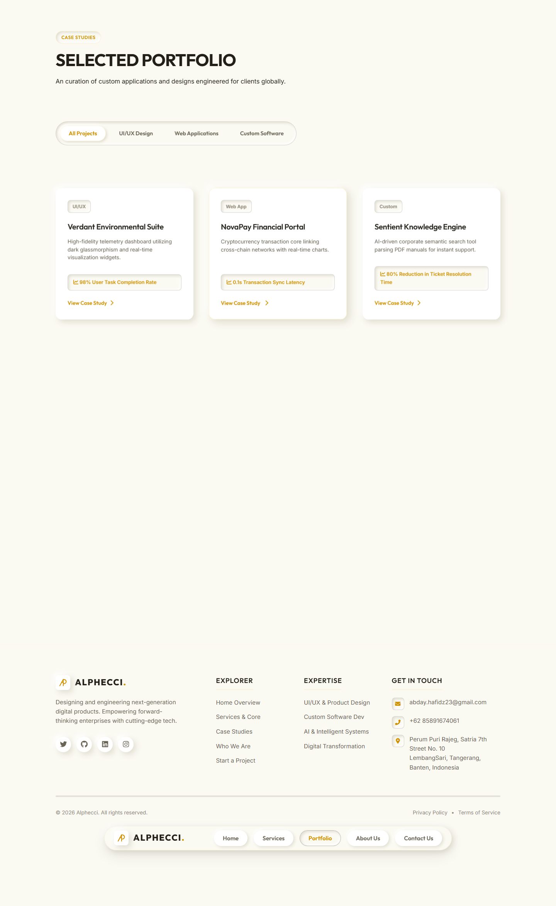
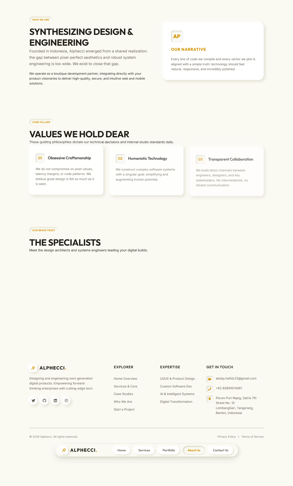
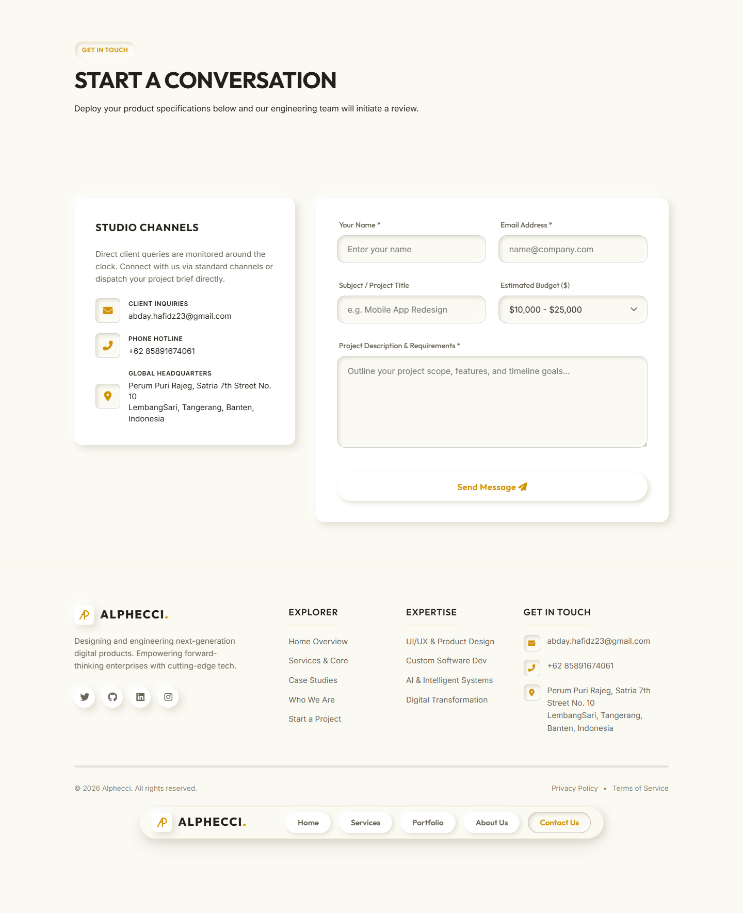
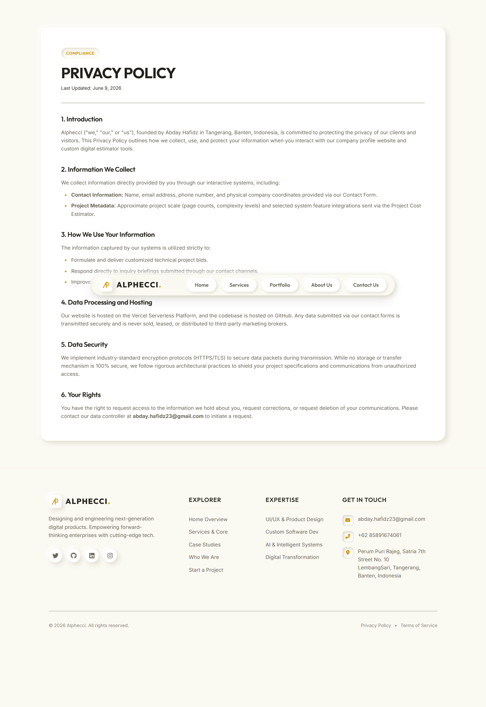
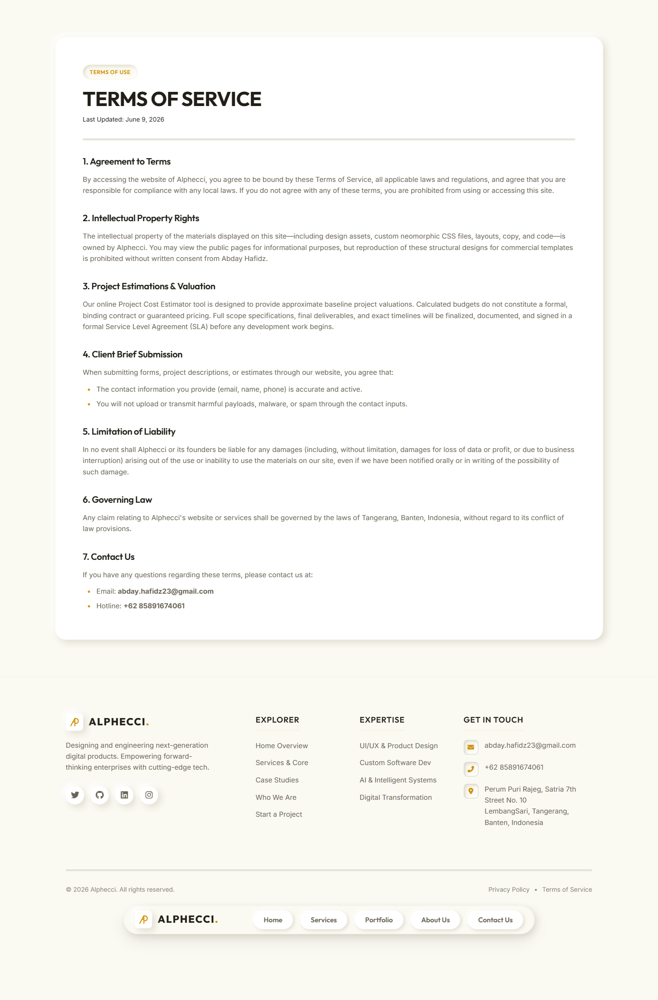

# ALPHECCI - Digital Product Studio

> **Alphecci** is a premium, state-of-the-art digital product studio specializing in designing and engineering next-generation user interfaces, custom software systems, and intelligent AI solutions. Built using a bespoke neomorphic warm-ivory design system, the site represents the pinnacle of modern web aesthetics and interactive engagement.

[](https://alphecci.vercel.app/)
[](https://github.com/abday-wong/ALPHECCI)
[](https://react.dev)

---

## Quick Access (Scan QR Code)

Scan the card below with your smartphone camera to quickly access the live website:

<p align="center">
  
</p>

---

## Visual Preview & Web Pages

Here is a visual overview of all the pages built into the Alphecci platform. Every component is handcrafted utilizing neomorphic shadow techniques (soft shadows, light borders, custom color glow effects) with a warm-ivory tone.

### 1. Home Page
*The gateway to Alphecci. Introducing our brand identity, core expertise hooks, and call-to-action touchpoints.*
<p align="center">
  
</p>

### 2. Services Page
*Detailed overview of our digital crafting modules: UI/UX & Product Design, Custom Software Development, AI & Intelligent Systems, and Digital Transformation. Users can directly request a service which automatically pre-fills the contact form.*
<p align="center">
  
</p>

### 3. Portfolio Page
*An interactive gallery of case studies showcasing web platforms, mobile apps, and machine learning models. Features a fully-interactive category filtering menu.*
<p align="center">
  
</p>

### 4. About Us Page
*Our manifesto, core values (Precision, Innovation, Integrity), and mission statement. Designed to build client trust.*
<p align="center">
  
</p>

### 5. Contact Us Page
*An elegant, interactive contact form with real-time EmailJS mail routing, comprehensive error handling, and visual neomorphic feedback. Includes studio contact details and Tangerang-Banten map location details.*
<p align="center">
  
</p>

### 6. Privacy Policy Page
*Full legal transparency regarding user data, cookies, and protection measures.*
<p align="center">
  
</p>

### 7. Terms of Service Page
*Standard studio terms of service covering intellectual property, contract execution, and operational frameworks.*
<p align="center">
  
</p>

---

## Features

- **Premium Neomorphic Design**: Curated HSL warm ivory-gold color palette with raised and sunken element cards, smooth gradients, and interactive hover effects.
- **Micro-Animations**: Orbiting system loading loaders, slow-reveal scroll transitions using `IntersectionObserver`, and elastic buttons.
- **Slow Loader Transitions**: A cyber-vibe navigation console loader that simulates loading sequences (between 800-850ms) to enhance UI premium quality.
- **EmailJS Integration**: Live email deliveries routing straight from the browser contact form to our studio inbox, complete with client template layouts.
- **Advanced SEO**: Full HTML meta setups, JSON-LD schema graphs, custom-made `sitemap.xml`, and Google-conforming `robots.txt`.
- **E2E Automation Ready**: Built-in playwright browser automation to easily capture screenshots of active page states.

---

## Tech Stack

- **Core**: React 19 (Hooks, custom state triggers)
- **Tooling**: Vite 8 (Hot Module Replacement, fast bundling)
- **Styling**: Pure CSS (No bulky frameworks, custom responsive layouts, neomorphic tokens)
- **Form Mailer**: EmailJS Browser Client
- **Testing/Automation**: Playwright (E2E browser control)
- **Hosting**: Vercel (Automatic GitHub deployment pipelines)

---

## Installation and Local Setup

Get the project running on your local machine in under 5 minutes:

### 1. Clone the repository
```bash
git clone https://github.com/abday-wong/ALPHECCI.git
cd ALPHECCI
```

### 2. Install dependencies
```bash
npm install
```

### 3. Setup Environment Variables
Create a file named `.env` in the root folder and configure your EmailJS credentials:
```env
VITE_EMAILJS_SERVICE_ID="your_service_id"
VITE_EMAILJS_TEMPLATE_ID="your_template_id"
VITE_EMAILJS_PUBLIC_KEY="your_public_key"
```

### 4. Run the Dev Server
```bash
npm run dev
```
Open your browser and navigate to `http://localhost:5173`.

### 5. Build for Production
```bash
npm run build
```
This outputs a fully-optimized bundle in the `dist/` directory, ready to deploy.

---

## Automated Screenshot Capture

We use a Playwright script `screenshot_pages.mjs` to automatically crawl our live website pages, navigate the SPA menu state, and render fresh high-resolution screenshots straight into `docs/screenshots/`.

To re-run the screenshots:
```bash
node screenshot_pages.mjs
```

---

## Contact Info and Details

- **Email**: [abday.hafidz23@gmail.com](mailto:abday.hafidz23@gmail.com)
- **Phone**: +62 85891674061
- **Location**: Satria 7th Street No. 10, Satria Rajeg, Tangerang, Banten, Indonesia
- **Vercel Host**: [alphecci.vercel.app](https://alphecci.vercel.app/)

---
*Created and maintained by [abday-wong](https://github.com/abday-wong).*
